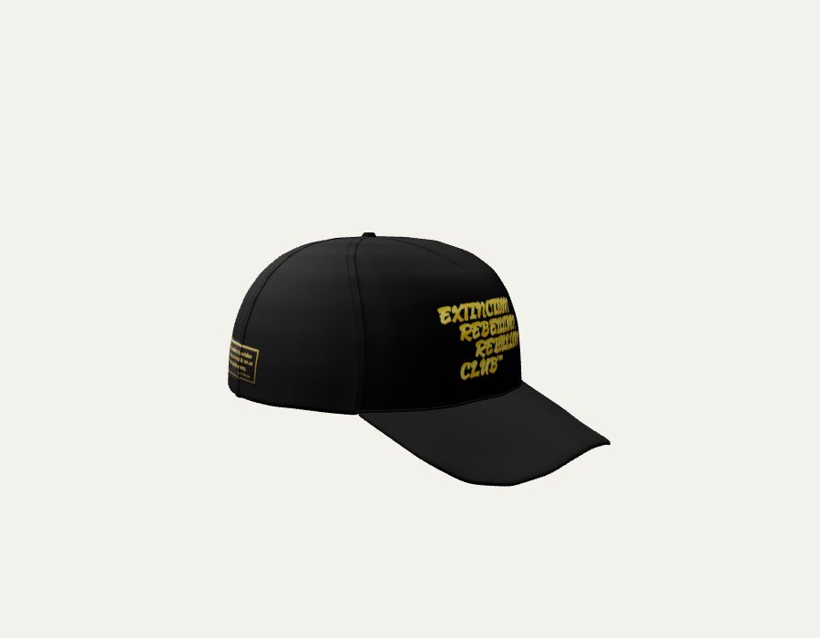

# 3D-кепка 🧢 — інтерактивний переглядач

Реалістична 3D-модель бейсболки для вебсайту: обертання мишкою, логотип спереду та дві картинки по боках (накладаються як decal'и просто на поверхню). Самодостатній статичний HTML — без збірки, фреймворків і бекенду.

🔗 **Демо:** https://denysosadchyi.github.io/cap3d/



---

## Можливості
- Реалістична модель (6 панелей, шви, строчка, вигнутий козирок), стиснена **Draco** → лише **~224 КБ**
- Обертання мишкою (OrbitControls) + плавний авто-оберт у спокої
- Логотип спереду + 2 бічні картинки, що **лягають по кривій** поверхні (THREE.DecalGeometry)
- Збереження пропорцій картинок, перефарбування кепки в будь-який колір
- Адаптивний розмір під контейнер, студійне освітлення (IBL)
- Вбудована процедурна кепка як запасний варіант (якщо немає GLB)

## Швидкий старт (локально)
Файли треба віддавати через **HTTP** (не `file://` — модулі та GLB не завантажаться):
```bash
cd cap3d
python3 -m http.server 8000
# відкрий http://localhost:8000/
```

## Інтеграція в сайт

### Варіант A — iframe (найпростіший)
Заливаєш папку на хостинг і вставляєш:
```html
<iframe src="https://denysosadchyi.github.io/cap3d/"
        title="3D кепка" loading="lazy"
        style="width:100%; height:600px; border:0;"></iframe>
```

### Варіант B — вбудувати напряму
1. Скопіюй папку `assets/` у свій проєкт.
2. У `<head>` сторінки додай importmap:
```html
<script type="importmap">
{ "imports": {
  "three": "https://cdn.jsdelivr.net/npm/three@0.160.0/build/three.module.js",
  "three/addons/": "https://cdn.jsdelivr.net/npm/three@0.160.0/examples/jsm/"
}}
</script>
```
3. У `<body>` додай контейнер і `<script type="module">…</script>` з `index.html`
   (від рядка `import * as THREE` до кінця). Підлаштуй `#cap { width/height }` під свій блок.

## Структура проєкту
```
cap3d/
├─ index.html                 # увесь код переглядача (Three.js, decal'и, керування)
├─ preview.png                # прев'ю для README
└─ assets/
   ├─ cap-real.glb            # 3D-модель кепки (Draco, ~224 КБ)
   ├─ logo.png                # логотип спереду  (заміни своїм, прозорий PNG)
   ├─ side-left.png           # ліва картинка
   ├─ side-right.png          # права картинка
   ├─ fabric_*.jpg            # тканинні текстури (тільки для процедурного запасного варіанта)
   └─ README.txt              # коротка пам'ятка
```

## Конфігурація
Усе налаштування — у блоці `CONFIG` на початку `<script>` в `index.html`:

| Параметр | Що робить |
|---|---|
| `modelUrl` | шлях до GLB; `null` = вбудована процедурна кепка |
| `modelColor` | колір кепки, напр. `0x141414` (чорний); `null` = лишити як є |
| `modelRotationY` | оберт моделі (радіани), щоб козирок дивився вперед (−Z) |
| `autoRotate` | авто-обертання, поки не чіпають мишкою |
| `logo` / `left` / `right` | картинки — поля нижче |

Для кожної картинки:
| Поле | Значення |
|---|---|
| `url` | шлях до файлу |
| `dir` | з якого боку: `[0,0,-1]` перед, `[-1,0,0]` лівий, `[1,0,0]` правий. Додай `+Z`, щоб зсунути до потилиці (напр. `[-1,0,0.7]`) |
| `height` | висота на кепці `0..1` (0 — низ, 1 — маківка) |
| `size` | ШИРИНА на кепці (висота рахується авто за пропорцією картинки) |

## Заміна картинок
Поклади свої файли в `assets/` з тими ж іменами (`logo.png`, `side-left.png`, `side-right.png`).
Рекомендації: прозорий PNG, квадрат або реальні пропорції, ≤ 1024 px. Онови сторінку.

## Заміна 3D-моделі
1. Поклади свою GLB у `assets/` і вкажи в `CONFIG.modelUrl`.
2. Якщо козирок не дивиться вперед — підбери `CONFIG.modelRotationY` (π/2≈1.57, π≈3.14).
3. Стиснути важку модель (потрібен Node):
```bash
npx @gltf-transform/cli weld  in.glb  weld.glb
npx @gltf-transform/cli draco weld.glb assets/cap-real.glb   # 2.98 МБ → ~230 КБ
```
   Draco-декодер уже підключено в `index.html` (з CDN gstatic).

## Технології
- [Three.js](https://threejs.org) r160 (ESM з CDN, importmap)
- OrbitControls, GLTFLoader + **DRACOLoader**, **DecalGeometry**, RoomEnvironment (IBL)
- Без npm-залежностей на проді — усе тягнеться з CDN і кешується

## Продуктивність
- Модель ~224 КБ (Draco), картинки ~243 КБ, код ~14 КБ
- 93k полігонів — миттєвий рендер навіть на слабких пристроях
- `pixelRatio` обмежено до 2; рендер через `setAnimationLoop`

## Ліцензії / атрибуція
- 3D-модель: **«Baseball Cap» by jomalon** (Sketchfab), **CC BY 4.0** — потрібна вказівка автора.
- Тканинні текстури: **ambientCG** (Fabric077), **CC0**.
- Картинки (логотип, патчі) — власність Extinction Rebellion Rebellion Club.
- Код: Three.js (MIT).

> Для публічного сайту додай у футер: *«Baseball Cap» by jomalon (Sketchfab), CC BY 4.0*.
